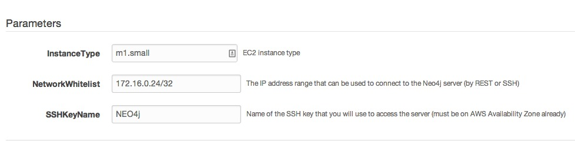
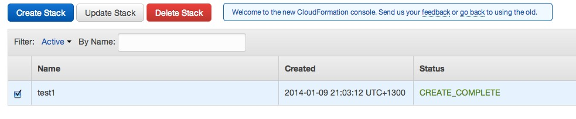
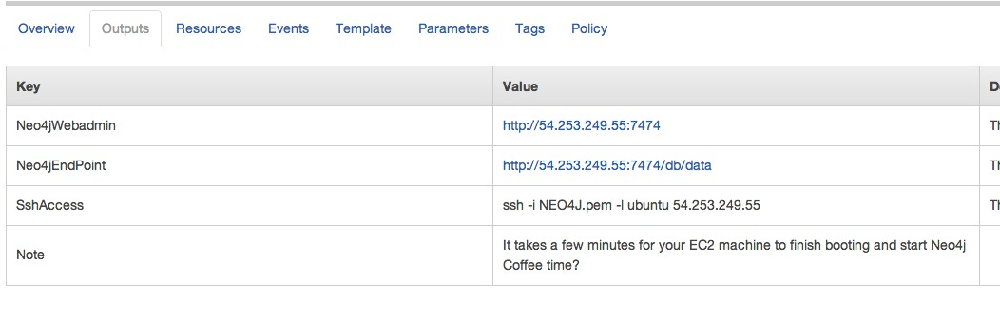

Neo4j CloudFormation Template
=============================

About
-----

This template creates a complete Neo4j installation, including [Amazon AWS](http://aws.amazon.com/) server, fixed IP
address and backup storage.  It's intended to help application developers get up and running quickly with Neo4j,
without in-depth experience of Linux servers, AWS, or installing databases like Neo4j.

It runs in all current (January 2014) Amazon Regions. It uses Amazon Security Groups to optionally secure the database.

Cost
----

If you use this tool, you'll be creating a "stack" of the following on Amazon AWS:

* One EC2 server (you choose the size)
* One Elastic IP address
* 100 GB of EBS storage
* One security group

Amazon will charge the cost for all this to your credit card on an hourly basis, from when you start the stack, until you stop the stack.
Please look up the [pricing calculator](http://calculator.s3.amazonaws.com/calc5.html) if you're concerned about
the hosting cost.

Pre-requisites
--------------

To use this tool you'll need:

* An AWS account, with credentials, and credit card on file
* An [EC2 key pair](https://github.com/neo4j-contrib/neo4j-puppet/blob/master/README.EC2_KEY.md), in the US-EAST zone (which is the default)
* A browser
* If you want to restrict access to the database, you'll want to know your IP address.  You can [Google that](https://www.google.com/search?q=what+is+my+ip+address&oq=what+is+my+ip+address).

Choosing an OS
--------------

We support 2 Operating Systems:

* Amazon Linux is based on Red Hat Linux, and the 2.0.1 release of Neo4j will be supported.
* Ubuntu Linux is an easy to use Linux distribution, and we recommend you use this if you're not sure which to choose.

Usage
-----

* Log onto [the AWS CloudFormation console](https://console.aws.amazon.com/cloudformation/home?region=us-east-1) with your AWS account.
* Click _Create New Stack_
* Fill in the _Stack Name_ field (whatever name you'd like)
* Click the _Provide a template URL_ radio button
* Paste [the Amazon Linux Template](https://cf-templates.neo4j.org.s3.amazonaws.com/amazon_linux.json) or [the Ubuntu Template](https://cf-templates.neo4j.org.s3.amazonaws.com/ubuntu.json) into the field next to the button
* Click the _Continue_ button
* Fill in the 3 parameters.
    * The _SSHKeyName_ parameter is the name of your EC2 Key pair (we suggested NEO4J)
    * The Network Whitelist allows you to control access to your database.  You can restrict it to your own IP address using the _/32_ suffix.  The default (0.0.0.0/0) will allow connections from anywhere on the public Internet.
    * The Instance Type lets you choose the size of machine to use.

* Click _Continue_ button
* You can optionally add tags to help identify your stacks.  Click _Continue_ button.
* You may review your options here.  Click _Continue_ button.
* Your stack is now being created.  Click the _Close_ button.
* Click the _Refresh_ button on the top right hand side of the CloudFormation view until your stack is complete.  You should see the image below:

* The running Neo4j server may not immediately be available.
* The _Output_ tab will show you the endpoint of the Neo4j server (see below).  Click on it, and when prompted for password, enter the password that you chose in pre-requisites.

* Configure your application to talk to the endpoint.

Decomissioning
--------------

If you're done using your Neo4j installation, you can delete the stack from the AWS CloudFormation console.

Troubleshooting
---------------

*Why might this go wrong?*

* Resources are sometimes not available at Amazon.  That's just part of our brave new cloudy world.  Right now the templates will attempt to use the first availability zone in the region.
* It's hard to legally and reliably get the Oracle JVM onto the system. So we're using OpenJDK.  This should not cause issues, but Neo4j may complain on start.  You can safely ignore that message.
* Sometimes, something will happen that we cannot predict.  We'd appreciate your help here; a [GitHub issue](/../../issues) or email to the Mailing List with some [smart questions](http://www.catb.org/esr/faqs/smart-questions.html#uselists) or observations.

*How to see detail:*

You can use the Get System Log feature of EC2 to see the output of this template.  If you're on the Amazon Linux template, you can SSH onto the machine and type '''cat /var/log/cfn-init.log'''.
